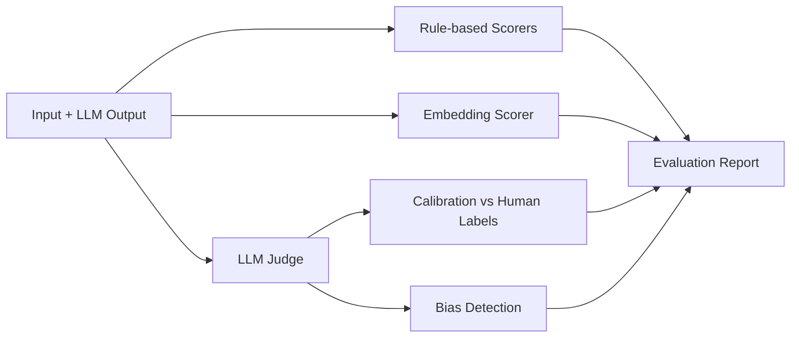

# EvalForge

**A pipeline that scores LLM outputs and then checks whether its own judge can be trusted — and finds, honestly, that it mostly can't yet.**

Given an input and an LLM-written output, EvalForge computes rule-based checks (length, keyword overlap, formatting), a semantic similarity score from a sentence-embedding model, and a 1-3 rating on four dimensions (faithfulness, relevance, coherence, conciseness) from a second LLM acting as judge. It then compares the judge's ratings against a human's ratings of the same outputs, so you can see how far the judge deserves to be believed. The demo dataset is 20 real failure summaries written by CI Brain, this author's test-failure triage project.

**The headline result is negative: on this dataset the judge agrees with the human labels only slightly better than chance (weighted kappa about 0.05).** The pipeline that measured this — not a passing judge score — is the useful part of the project. See [Results](#results) and [Limitations](#honest-limitations).

## Why EvalForge

"LLM-as-judge" is the default way teams check LLM output at scale, but a judge that hasn't been checked against humans is a guess wearing a number. EvalForge is a small, self-contained framework for running that check: score outputs several ways, calibrate the judge against real human labels, and look for the two biases (verbosity, position) that most commonly make a judge look better than it is.

## Architecture



Rule-based and embedding scorers run on every request. The judge, calibration, and bias detection are the pipeline this project is actually about — everything downstream of the judge exists to say how much to trust it.

## Key capabilities

- Rule-based scoring: length, TF-IDF keyword overlap, format checks
- Semantic similarity via `sentence-transformers` (`all-MiniLM-L6-v2`)
- LLM-as-judge (Gemini) on 4 dimensions, versioned prompts, resumable batch runs
- Judge calibration against human labels via quadratic-weighted Cohen's kappa
- Verbosity and position bias detection
- FastAPI service with single and batch evaluation endpoints
- CI eval gate that fails a push if judge agreement or coverage regresses

## Results

Judge vs human agreement on the same 20 human-labelled examples, quadratic-weighted Cohen's kappa (0 = chance, 1 = perfect). Source files are in `reports/`.

| Judge model | Prompt | Records judged | faithfulness | relevance | coherence | conciseness | **weighted avg** |
|---|---|---|---|---|---|---|---|
| gemini-3.1-flash-lite | v1 | 20 / 20 | 0.065 | 0.00 | 0.00 | 0.00 | **0.016** |
| gemini-3.1-flash-lite | v2 | 20 / 20 | 0.035 | 0.00 | 0.00 | 0.179 | **0.053** |
| gemini-3.6-flash | v2 | 12 / 20 (quota) | -0.05 | 0.00 | 0.00 | 0.20 | **0.037** |

What is behind the numbers:

- **The judge is lenient.** On relevance and coherence it gave a 3 to every record, so kappa is 0 by construction (a rater that never varies cannot agree beyond chance). On conciseness the human gave 1 or 2 to 16 of 20 outputs and the judge mostly answered 3.
- **Faithfulness** was the only dimension where the judge varied, and its agreement with the human was no better than chance.
- Rewording the prompt (v1 to v2) and switching to a newer model did not change this. The `gemini-3.6-flash` row covers only the 12 records that finished before the free-tier quota stopped the run, so it is not directly comparable.
- **Verbosity bias:** no significant length-score correlation (v2: Pearson r = -0.34, p = 0.15, n = 20; v1: r = 0.04, p = 0.87).
- **Position bias:** the detector is implemented and unit-tested with a mock judge. It has **not** been run against a real judge, so there is no measured flip rate.

Scorer averages over the 20 outputs (no human labels involved): length 0.96, keyword overlap 0.43, format 0.76, embedding relevance to input 0.53.

## Design decisions

- **1-3 scale, not 1-5.** Three levels are quicker to annotate consistently by hand, and the judge is asked for the same integers, so kappa compares the two directly with no remapping. The cost: less resolution, and labels bunch up (17 of 20 relevance labels are 3), which makes kappa unstable on those dimensions.
- **Quadratic-weighted kappa.** The scores are ordinal, so a 1-vs-3 disagreement should cost more than a 2-vs-3 one. Plain percentage agreement is also reported (`details.exact_agreement`) because with skewed labels it can look high while kappa is near 0 (relevance: 85% agreement, kappa 0.00).
- **LLM judge plus human labels.** Human labels are the ground truth used only to calibrate the judge; the judge is what scales. That only works if the calibration number is good, and here it is not.
- **Track `judge_coverage`.** A judge can fail to return a usable score (unparseable output, safety block, API quota). Dropping those records silently can make the kappa describe only the easy cases, so the report states what fraction was judged. In this project the missing records were caused by the free-tier API quota, not by hard cases.
- **Bias checks.** A judge that rewards longer outputs inflates scores without anyone noticing, so verbosity bias (length vs judge score) and position bias (does the verdict flip when two outputs are swapped) each have a detector.
- **Judge model differs from the writer.** The summaries were written by `gemini-3.5-flash`; the judges are other models, to limit self-preference. They are still the same model family.
- **Resumable judge runs.** Results are appended as they are produced and keyed by prompt version and model, so a run stopped by the quota continues where it left off and earlier results are never overwritten.

## Quickstart

```bash
git clone <this repo> && cd evalforge
pip install -e ".[dev]"

pytest tests/                                    # 83 tests, no API key needed (judge calls are mocked)

export EVALFORGE_API_KEY=choose-a-secret         # required for /evaluate endpoints
export GEMINI_API_KEY=...                        # optional; enables the judge
uvicorn evalforge.api:app --reload               # then open http://localhost:8000/docs

python -m evalforge.evaluate v2                  # full eval on data/golden (real judge, ~20 API calls)
python -m evalforge.evaluate v2 --gate --min-kappa 0.05 --min-coverage 0.75   # what CI runs
```

Docker: `docker build -t evalforge . && docker run -p 8000:8000 -e EVALFORGE_API_KEY=secret evalforge`.

## Tech stack

Python 3.11, FastAPI, `sentence-transformers`, Gemini API (`google-genai`), scikit-learn (Cohen's kappa), SciPy (Pearson correlation), pytest, Docker, GitHub Actions, Render.

## Project structure

```
src/evalforge/
├── config.py          paths, model names, thresholds
├── dataset.py          golden dataset loader and validator
├── scorers/
│   ├── rule_based.py   length, keyword overlap, format checks
│   ├── embedding.py     semantic similarity via sentence-transformers
│   └── llm_judge.py    Gemini-as-judge with versioned prompts
├── calibration.py      judge vs human agreement (Cohen's kappa)
├── bias.py             position and verbosity bias detection
├── evaluate.py          full eval pipeline, writes reports/eval_report.json
└── api.py               FastAPI app
data/golden/              20 human-annotated examples
reports/                  eval reports and calibration output
tests/                    pytest suite
```

## API reference

| Method and path | Auth | What it does |
|---|---|---|
| `GET /health` | none | Status, golden dataset size, embedding model, judge model |
| `GET /report` | none | Most recent `reports/eval_report*.json`, or `{"error": "no report found"}` |
| `POST /evaluate` | `X-API-Key` | Body `{input, output, reference?}`. Returns `rule_based` (length, keyword_overlap, format), `semantic` (relevance, semantic_sim if `reference` given), `judge` (1-3 per dimension, or `null`), `metadata` (judge_prompt_version, judge_model, judge_failed) |
| `POST /evaluate/batch` | `X-API-Key` | Body `{items: [{input, output}]}`, 1 to 50 items. Returns `results` (each shaped like `/evaluate`), `total`, `failed` (judge attempts that returned nothing) |

Missing or wrong `X-API-Key` returns 401; a server with no `EVALFORGE_API_KEY` set returns 503 (fails closed). Without `GEMINI_API_KEY` the judge is skipped, `judge` is `null`, and `judge_failed` is `false` (skipped, not attempted). Empty text scores 0.0 and is never sent to the judge.

## CI

`.github/workflows/ci.yml` runs `ruff`, the test suite, and on push to `main` an eval gate that runs the real judge on the golden set. The gate fails if weighted kappa is below 0.05 or fewer than 75% of records were judged. Both thresholds are deliberately low: 0.05 is today's measured level (a regression guard, not evidence the judge is good), and 0.75 exists because the free-tier quota stops runs at about 16 of 20 records. The design targets in `config.py` are 0.4 and 0.9. The workflow has not yet run on GitHub.

## Honest limitations

- **The judge does not agree with the human.** Weighted kappa about 0.05 (see Results). Do not read the `judge` field as a validated quality signal.
- **20 examples, one annotator.** All from one repository's test failures (toolz). There is no second annotator, so the human labels themselves are unvalidated, and 4 test records are too few to check a tuned prompt.
- **Skewed labels.** Relevance and coherence are almost all 3, so kappa on them says little either way.
- **Position bias is detected, not corrected, and not measured on a real judge.**
- **Same-family judge.** Different models from the writer, but all Gemini.
- **Keyword overlap is crude.** TF-IDF keywords from CI prompts are mostly test identifiers, so it rewards repeating test names.
- **Free-tier API quota** stops full runs; the CI gate therefore judges a subset.
- **Not yet deployed.** `render.yaml` and the Dockerfile are ready and the image builds and runs locally; there is no live URL yet.

## Future improvements

- A deterministic sentence-count check for conciseness
- Few-shot examples in the judge prompt, drawn from records outside the 20
- Run position bias detection against a real judge (currently mocked-only)
- A second human annotator to validate the golden labels themselves
